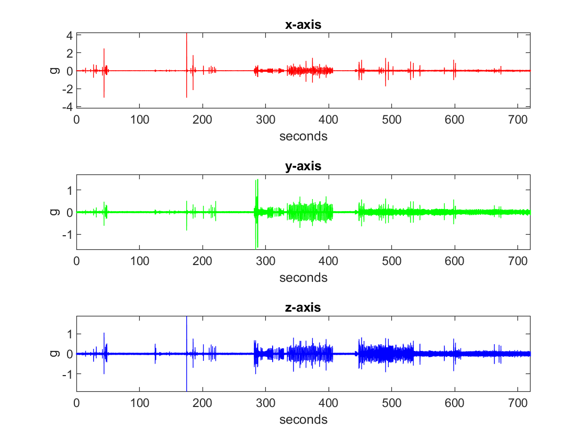

# iis3dwb-247

This is a demo application to save data from ST's [IIS3DWB ultra-wide bandwidth vibration sensor](https://www.st.com/en/mems-and-sensors/iis3dwb.html) directly to a persistent storage (SD card). Therefore, it can be used 24/7, as long as there is enough free storage.

It is designed to be used on a Raspberry Pi (tested on a RPi 4 4GB) running the standard Raspian (64-bit) distribution.

It does not use any 3rd party code, only requirement is the availability of spidev.

Although the implementation is coupled to an IIS3DWB sensor, the design and the source code can be used as an example of a producer-consumer pattern.

# Usage

Build the application with `make`.

Run `./iis3dwb <duration_in_seconds>` like `./iis3dwb 3600` for one hour.

# Design

The demo application uses the SPI system at 10MHz and in SPI_MODE_0. By default `spidev0.0` is used.

The demo application configures the IIS3DWB sensor to run in continuous FIFO mode (where the new sample overwrites the older one) and enables timestamp batching in FIFO with no decimation (or decimation=1). This means there is going to be always a pair of timestamp and accelerometer samples one after other in the FIFO. The FIFO can contain maximum 512 samples (thus 256 timestamps and 256 accelerometer data for this demo). A FIFO overrun (overflow) is indicated with FIFO_OVR_IO flag in FIFO_STATUS2 and the number of entries in FIFO is indicated with DIFF_FIO in FIFO_STATUS1 and FIFO_STATUS2 registers.

Block data update, automatic register address increment and wraparound is also enabled. 

By default the full scale of +-4g is used, it can be changed at compile-time.

The demo is started by providing a duration in seconds (which is stored in `duration` variable). By reading the INTERNAL_FINE_FREQUENCY register, actual output data rate (ODR) is calculated and the amount of samples required is kept in a variable called `nsamples`. This is actually a double of what is required because each accelerometer sample is paired with a timestamp sample.

After configuring the sensor, the demo creates two (p)threads.

First thread is `sensor_reader`, which does the synchronuous SPI transaction to read a certain amount of samples from the FIFO. The SPI transaction transmit buffer (`fifo_tx` variable) is always the same since the command is always the same, and the receive buffer is always a part of the circular 2D buffer (`fifo_rx` variable). `sensor_reader` continues its operation until requested amount of samples are read from the sensor in an infinite while loop.

Second thread is `file_writer`, which reads the FIFO samples from the circular 2D buffer (lines) and writes them to a file (named `fifo.bin` by default). `file_writer` continues its operation until requested amount of samples are written to the output file in an infinite while loop.

The only variable both threads modify is `fifo_rx_nlines`. The lines that modify this variable is locked with a mutex.

## Circular 2D Buffer

A traditional circular buffer keeps a single byte at each position. It is possible to use a similar construct in this application but I decided to make a variation which does not have a single byte but another (fixed length) byte array at each position, thus the circular buffer has two dimensions. I called the byte array at each position of the circular buffer a `line`. It is configurable at compile-time but each line can contain maximum 256 FIFO samples (each sample is 7 bytes), and the maximum size of a line is `2 + 256 * 7` bytes. The first byte of a line contains how many FIFO samples the line actually contains (although the line might have a larger size). The second byte of a line is not used, because `line+1` is used as SPI receive buffer, and the first byte of a FIFO read transaction will contain a dummy byte. Thus, the actual samples are stored starting at `line+2`.

The empty and full status of this circular 2D buffer is checked by the threads using `fifo_rx_nlines` variable. Hence, this is the only time a mutex is used when increasing or decreasing this variable.

The default compile-time configuration of the circular 2D buffer has 1M (1024x1024) lines where each line can contain maximum 64 samples. Thus, the circular 2D buffer consumes `1M*(2+64*7 =~ 450MB` memory. It is probably possible to decrease this, I have not tested.

## Handling FIFO Overrun

If a FIFO overrun happens, as described in [ST's IIS3DWB appnote](https://www.st.com/resource/en/application_note/an5444-iis3dwb-ultrawide-bandwidth-lownoise-3axis-digital-vibration-sensor-stmicroelectronics.pdf), the samples in FIFO are omitted until a new timestamp is read. This timestamp value is saved to the circular buffer, and then the operation continues normally.

## Thread Affinity

The demo is run on a RPi 4, which has 4 cores and the threads are assigned to a specific core and Linux is prevented from using these cores.

First, the kernel cmdline in `/boot/cmdline.txt` is modified to contain `isolcpus=2-3`. This isolates the core 2 and 3 from the Linux scheduler, thus no process is automatically run on these cores.

Then, after creating the threads, demo application sets the affinity of `sensor_reader` thread to core 2 and `file_writer` thread to core 3.

In effect, core 2 and core 3 is only used by the demo application without any interruption from Linux.

## Progress

During the data collection, a single character is displayed periodically to indicate the progress and the status of operation during a period. This character can be a `.`, a hexadecimal number `0-9A-F` or `X` or an `!`. 

- `.` indicates a normal operation
- `0-9A-F` or `X` indicates the number of times a line was smaller than the amount of samples in FIFO. Because FIFO can contain 512 samples, but a line can have maximum 256 samples, this can happen. `X` means more than `F` times.
- `!` indicates at least one FIFO overrun event has happened.

The period is every second when duration is <= 1 hour, every 5 seconds when duration is <= 6 hours, and 10 seconds otherwise.

## Statistics

At the end of the demo application, either terminating normally and successfully or with an error or interrupted with Ctrl-C, three types of statistics are displayed; for sensor_reader, fifo_rx and file_writer.

`sensor_reader` statistics are:

- `samples_read`: number of samples read from the sensor (>= nsamples)
- `cnt_ovrs`: number of times FIFO overrun happened
- `max_diff_fifo`: maximum DIFF_FIFO value encountered
- `avg_diff_fifo`: average DIFF_FIFO (= cumulative sum of diff_fifo / cnt_pos_diff_fifos)
- `cnt_pos_diff_fifos`: number of times DIFF_FIFO was positive in infinite while loop
- `cnt_neg_diff_fifos`: number of times DIFF_FIFO was zero or negative in infinite while loop
- `cnt_write_idx_reset`: how many times fifo_rx_write_idx is reset, meaning the circular 2D buffer is travelled

`fifo_rx` statistics are:

- `max_fifo_rx_nlines`: the maximum `fifo_rx_nlines` encountered. This is basically the difference between the write and the read indices, the distance between the `sensor_reader` and the `file_writer`.
- `cnt_line_too_small`: how many times a line was smaller than DIFF_FIFO value
- `line_usage`: this is a histogram of how many times a line of certain size (number of samples) is used. It contains count values from 0 to maximum number of samples in a line.
- `line_usage_total_nsamples`: sum from 0 to maximum number of samples in a line multiplied by number of times a line of that size is used. This is basically the cumulative number of samples stored in the circular 2D buffer.

`file_writer` statistics are:

- `samples_written`: number of samples written to `fifo.bin`
- `bytes_written`: number of bytes written to `fifo.bin` (samples_written * 7)
- `cnt_pos_fifo_rx_nlines`: number of times nlines were positive (thus a file I/O happened)
- `cnt_pos_fifo_rx_nlines`: number of times nlines were zero or negative
- `cnt_read_idx_reset`: how many times fifo_rx_read_idx is reset, meaning the circular 2D buffer is travelled

It is expected that the `samples_written`, `samples_read` and `line_usage_total_nsamples` which identifies the samples read, stored in the circular 2D buffer (lines) and written to file are all equal and equal or greater than `nsamples`.

In a successful run which is actually the expected result, `cnt_ovrs` has to be zero (no FIFO overruns), `max_fifo_rx_nlines` and `cnt_line_too_small` should not be too high. See [Performance](Performance) for some examples.

## Metadata

In addition to `fifo.bin`, a file named `fifo.bin.meta` is also created. This file contains the following information:

- `int year`, `int month`, `int day`: year (e.g. 2023), month (1-12) and day of month (1-31)
- `int hour`, `int minutes`, `int seconds`: hour (0-23), minutes (0-59) and seconds (0-61)
- `uint32_t duration`: in seconds requested in the command line
- `uint64_t nsamples`: amount of samples targeted to acquire from the sensor. The file `fifo.bin` may contain a few samples more than this. It is calculated as `2 * duration * odr` where odr is the actual output data rate `odr` below.
- `double full_scale`: full_scale value, e.g. 2.0 for +-2g
- `double odr`: calculated actual output data rate (ODR) used during this sample acquisition
- `double afactor`: accelerometer factor that has to be multiplied by accelerometer sample values to convert them to g units
- `double tfactor`: time factor that has to be multiplied by the timestamp sample values to convert them to second units. This is the same as the calculated actual timestamp resolution.

## 64-bit Support

Because the concept of this demo is to record 24/7, some variables and files can easily pass 32-bit limit. The relevant variables are defined as `uint64_t`. Also, `_FILE_OFFSET_BITS 64` is defined, so there is no 2GB limit.

## Timestamp Overflow

Timestamp value is an 32-bit unsigned integer, and it wraps back to 0 after the maximum (0xFFFFFFFF) is reached. This is approximately 15 hours. The demo resets the timestamp counter to zero at the beginning, after this it does not check the value of the timestamp. The application processing the values in `fifo.bin` has to handle the timestamp overflow condition.

# fifo2xyzt

[iis3dwb-fifo2xyzt](https://github.com/metebalci/iis3dwb-fifo2xyzt) is a tool to create x,y,z and t arrays from `fifo.bin` and `fifo.bin.meta`. This tool also handles the timestamp overflow condition.

# Result

Below is a plot of 720 seconds of samples, converted with iis3dwb-fifo2xyzt and plotted with MATLAB after mean is subtracted.

# Performance

## 720 seconds (12 minutes)

The run which generated the 720 seconds plot above resulted:

- cnt_ovrs: 0
- max_fifo_rx_nlines: 21
- cnt_line_too_small: 0

This is quite a perfect run, no FIFO overruns, no line was too small and `max_fifo_rx_nlines` is pretty small comparing to available number of lines (1M).

## 3600 (1 hour)

## 21600 (6 hours)

## 86400 (24 hours)
